
  <h3>RATools for Word - 专为药品注册（RA）打造的 Word 效率插件</h3> 
基于实战经验开发，提升申报资料编写效率，助力注册申报工作更上一层楼。
 

## 📖 项目简介

本插件基于 `.dotm`（启用宏的模板）定义功能核心，并通过 `.dotx` 文件管理样式模板。旨在解决药品RA人在文档编写中频繁切换选项卡、格式调整繁琐等痛点。

**主要特性：**

- **实战导向**：功能源于开发者在注册申报过程中的长期实践，精准解决痛点。
- **兼容性**：已在 Windows 10 / 11系统下的 Microsoft 365 Word环境中测试通过，理论上支持Office 2010之后的至今所有Word版本（请自行测试）。
- **持续迭代**：后续将根据实际需求，持续添加更多便捷功能。

  

## ⚙️ 安装与配置

为了确保插件正常运行，请严格按照以下步骤进行配置。

### 1. 下载与文件准备

- 前往 [Releases](https://github.com/Fon509/RATools/releases) 下载最新的 `.dotm` 和 `.dotx` 文件。
- **创建目录**：建议在 D 盘根目录创建`RATools`文件夹，将 `.dotx` 和 `.dotm` 放入其中

> **注意**：您也可以自定义文件路径，但后续步骤需对应修改路径配置。本文档以推荐路径 `D:\RATools` 为例。

 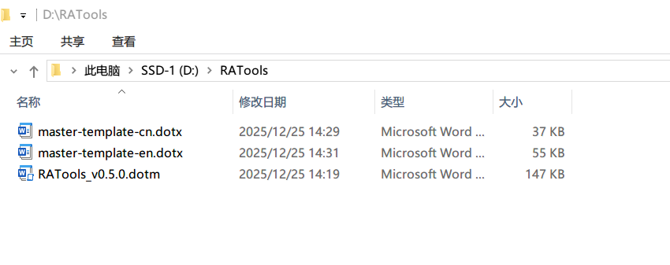 

### 2. 配置 Word 启动路径

1. 打开 Word，点击左上角 **「文件」** -> **「选项」**。

   
 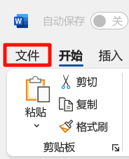  
 

2. 在弹出的对话框中点击 **「高级」**，向下滑动至“常规”栏目，点击 **「文件位置」**。

   
 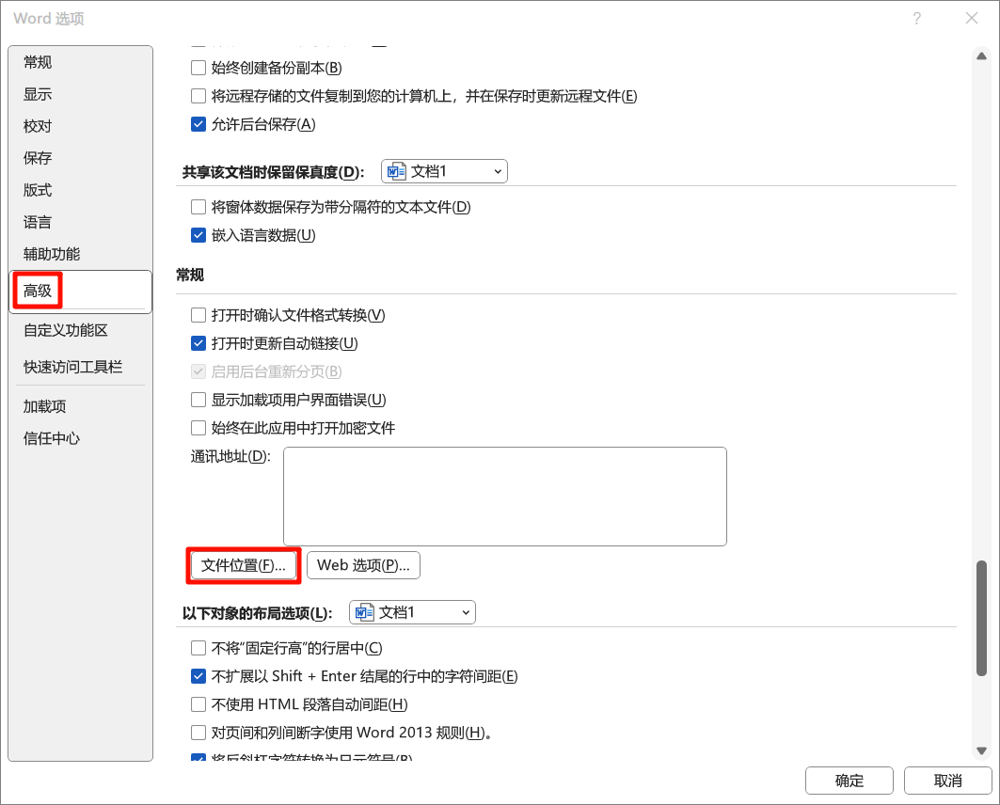 
 

3. 选中 **「启动」** 项，点击“修改”，选择存放 `RAtools.dotm` 的文件夹路径（例如：`D:\RATools`）。

 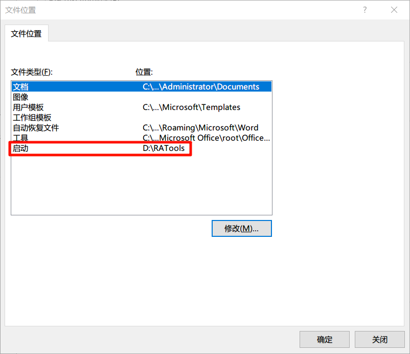 

### 3. 添加受信任位置

为防止宏被系统安全策略拦截，需将插件目录设为受信任位置：

1. 在 Word 选项对话框左侧，选择 **「信任中心」** -> **「信任中心设置」**。

   
 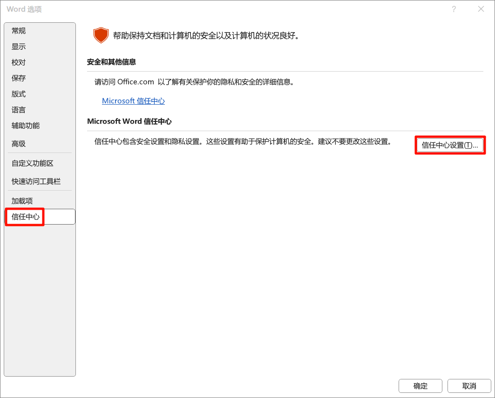 
 

2. 选择 **「受信任位置」**，点击 **「添加新位置」**。

   
 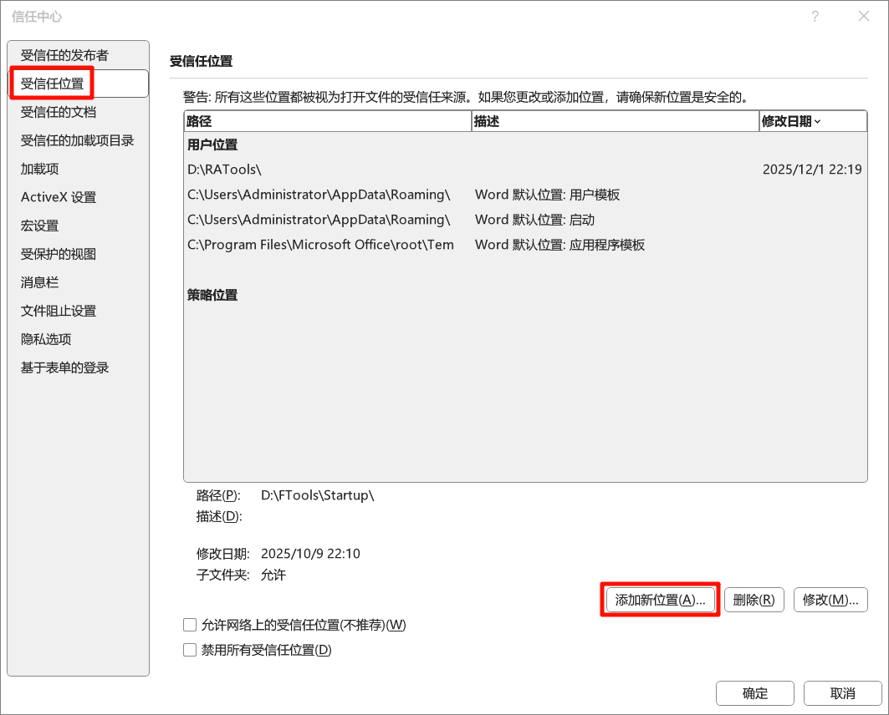 
 

3. 点击 **「浏览」**，选择插件文件夹路径（`D:\RATools`），确认无误后点击 **「确定」** 保存所有设置。

 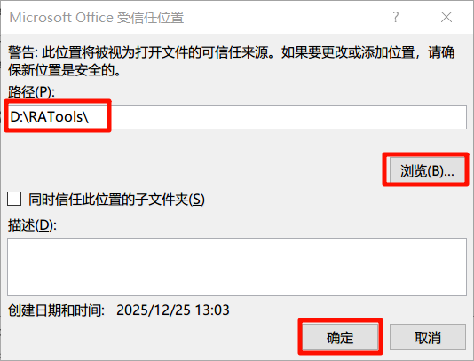 

  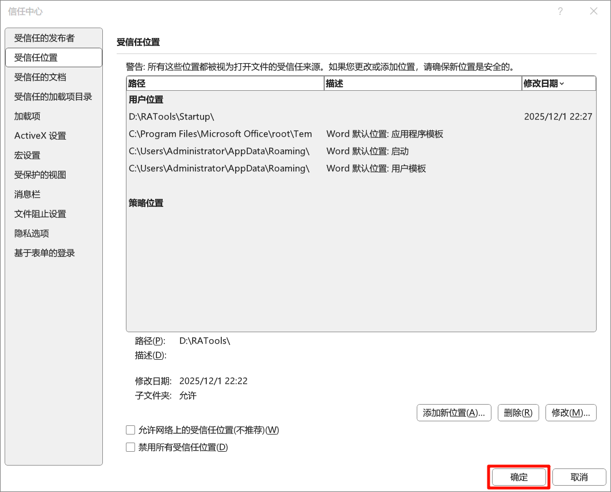 

## 🚀 使用指南

### 加载模板

配置成功后，Word 顶部会出现 **「RATools」** 选项卡。

1. 点击 **「点击加载」** 按钮即可挂载模板样式（每个文件仅首次需要进行加载）。

   
  
 

2. 在v0.5.0的更新中，加入了中英文模版功能，目前挂载模版逻辑如下：

   - 如果 `RAtools.dotm` 同目录下仅存在 `master-template-cn.dotx` 或 `master-template-en.dotx` 中的一个，默认挂载该模版中的样式。

     
 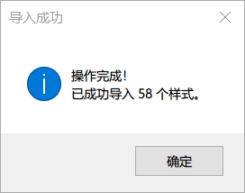 

   - 如果 `RAtools.dotm` 同目录下同时存在 `master-template-cn.dotx` 和 `master-template-en.dotx` ，会弹出对话框选择需要挂载的模板或自行选择其他模板文件。

     
 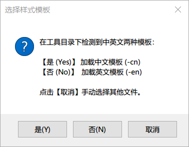 

   - 如果 `RAtools.dotm` 同目录下不存在任何模板文件，会弹出对话框进行模版文件选择。

     
 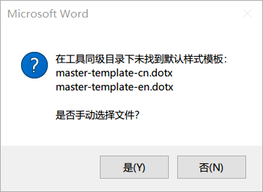 

3. 成功加载后将提示 **「操作完成」**。

### 功能模块详解

当前版本集成了三大核心模块：

#### 1. 样式快速应用

基于 `.dotx` 定义的标准样式模板，提供一键应用预设样式功能，统一文档格式标准。

#### 2. 常用选项

将分散在 Word 不同选项卡中的高频功能（如字体、段落等）聚合至同一面板，减少鼠标点击与页面切换，显著提升操作流。

#### 3. 增强型宏工具

内置宏列表对话框，比 Word 原生界面更清晰直观，同时在v0.5.1版本中添加了搜索功能。目前已内置以下宏：

| **功能名称**                 | **说明**                                                     |
| ---------------------------- | ------------------------------------------------------------ |
| **超链接和域批量设置为蓝色** | 智能遍历文档，将所有超链接和域（REF/PAGEREF等）的颜色设置为蓝色，但在处理过程中会自动排除图表题注和页码。（如有 Bug 欢迎反馈） |
| **域格式保护**               | 扫描全文或选区内的引用域，自动添加 \* MERGEFORMAT 开关，防止更新域后格式丢失。 |
| **Word批量转PDF**            | 批量将单个或多个Word转为PDF，并通过Word标题创建PDF书签。     |
| **批量修改文件名**           | 批量修改文件名 1. 仅保留汉字、字母、数字、中划线和下划线 2. 字母/数字间的空格改为中划线，汉字与字符间的空格（以及其他剩余空格）直接删除，其他非法字符替换为中划线 "-" 3. 支持“文件夹模式”和“多文件选择模式” 4. 如果文件被占用无法重命名，自动创建改名后的副本 |
| **标题自动编号转文本**       | 将文档中所有标题（大纲 1-9 级）的自动编号转换为固定的静态文本。 |
| **重命名当前文件**           | 无需关闭文件，直接重命名当前文件。                           |
| **一键设置页边距**           | 一键将单个或多个文件页面上、下、左、右的页边距设置为 2.54厘米（即标准的 1 英寸）。 |
| **一键表格自动调整**         | 将文档中所有表格批量设置为“根据窗口自动调整”                 |
| **批量接受修订并删除批注**   | 批量将单个或多个文档的tracking版转换为clean版，接受所有修订并停止修订同时删除文档中的所有批注。 |

## ⬆️ 进阶用法

### 修改.dotx文件实现样式自定义，满足自己独特的样式偏好

### 创建属于自己的宏并添加至宏列表中

## 📝 交流与反馈

如果您在使用过程中遇到问题或有新的功能建议，欢迎提交 Issue 或联系开发者。

## 📅 更新日志

查看版本更新历史，请参阅 [CHANGELOG](https://github.com/Fon509/RATools-for-Word/blob/main/CHANGELOG.md)。
